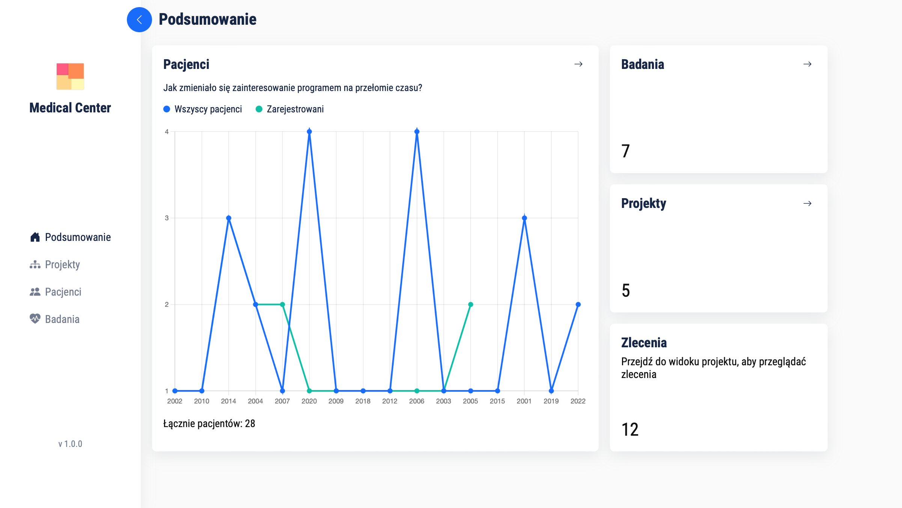

# Ośrodek Medyczny
Aplikacja webowa ułatwiająca zarządzanie ośrodkiem badawczym.

### Testy
Aplikacja była testowana na systemie Linux Ubuntu oraz MacOS.

### Wykorzystane technologie
 - ReactJS
 - NodeJS 
 - MySQL

## Demo


## Wymagania
 - Docker (najłatwiejszy sposób uruchomienia programu)

## Konfiguracja
Na potrzeby zadania w repozytorium zawarto przykładowy plik .env (znajdujący się w katalogu [server/.env](https://github.com/sniescior/medical-center/blob/main/server/.env)).


Zmienne środowiskowe DB_NAME oraz SERVER_PORT __NIE POWINNY BYĆ ZMIENIANE__ (będzie to skutkować niepoprawnym działaniem systemu)

## Instalacja
Po pierwsze należy sklonować repozytorium (branch main)
```
git clone https://github.com/sniescior/medical-center.git
```

Następnie, otwierając nowy terminal w folderze głównym projektu wywołać polecenie
```
docker-compose --env-file ./server/.env up
```

W przypadku, jeżeli plik .env został przeniesiony do innego miejsca - zamiast *./server/.env* należy podać ścieżkę do tego pliku.

Docker compose powinien utworzyć instancję bazy danych, serwer oraz klienta aplikacji.
Łącznie 3 kontenery w ramach jednej sieci:
 - mysqlcontainer           (10.5.0.5)
 - nodeservercontainer      (10.5.0.6)
 - reactappcontainer        (10.5.0.7)

I tyle...

Jeżeli w terminalu wyświetlił się komunikat:
```
You can now view medical-center in the browser.
    Local:            http://localhost:3000
    On Your Network:  http://10.5.0.7:3000
```
Oznacza to, że instalacja przebiegła pomyślnie i można otworzyć w witrynę http://localhost:3000

## Baza danych
Docker zadba o inicjalizację bazy danych wraz z przykładowymi danymi. Pliki konfiguracyjne bazy danych znajdują się w katalogu [server/database](https://github.com/sniescior/medical-center/tree/main/server/database).


## Rozwiązywanie błędów
Może się zdarzyć, że aplikacja klienta otworzy się zanim serwer zostanie skonfigurowany. Objawi się to wyświetleniem błędu 500. W takim przypadku należy zrestartować kontener serwera (nodeservercontainer) oraz klienta (reactappcontainer), upewniając się, że przed uruchomieniem klienta, serwer jest aktywny.

